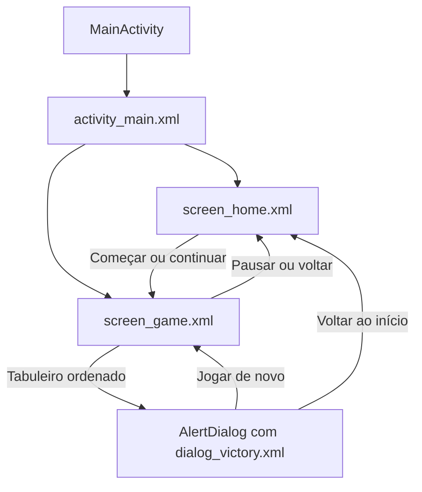

# Slide8

**Um quebra-cabeça de deslizar 3×3 para Android, desenvolvido em Java e Views nativas.**

O objetivo é organizar oito peças numeradas de **1 a 8**, usando um único espaço
vazio para movimentá-las. A experiência inclui tela inicial, peças arrastáveis,
animações, cronômetro, contador de movimentos, indicador de progresso e celebração
de vitória.

O aplicativo funciona offline e utiliza somente recursos do SDK do Android. Não
usa AndroidX, Jetpack Compose, Unity, Godot, bibliotecas de interface ou desenho
com Canvas customizado.

## Sumário

- [Como jogar](#como-jogar)
- [Telas e funcionalidades](#telas-e-funcionalidades)
- [Tecnologias e linguagens](#tecnologias-e-linguagens)
- [Requisitos e configuração](#requisitos-e-configuração)
- [Compilação e instalação](#compilação-e-instalação)
- [Estrutura do projeto](#estrutura-do-projeto)
- [Organização do código](#organização-do-código)
- [Lógica do quebra-cabeça](#lógica-do-quebra-cabeça)
- [Gestos e animações](#gestos-e-animações)
- [Cronômetro e ciclo de vida](#cronômetro-e-ciclo-de-vida)
- [Interface e acessibilidade](#interface-e-acessibilidade)
- [Testes e validação](#testes-e-validação)
- [Personalização](#personalização)
- [Solução de problemas](#solução-de-problemas)
- [Escopo atual](#escopo-atual)

## Como jogar

1. Na tela inicial, pressione **Vamos jogar**.
2. Localize o espaço vazio, identificado por uma borda tracejada.
3. Arraste uma peça vizinha horizontal ou verticalmente em direção ao vazio.
4. Solte a peça após deslocá-la o suficiente para confirmar o movimento.
5. Continue até obter esta disposição:

```text
┌───┬───┬───┐
│ 1 │ 2 │ 3 │
├───┼───┼───┤
│ 4 │ 5 │ 6 │
├───┼───┼───┤
│ 7 │ 8 │   │
└───┴───┴───┘
```

As peças verdes já estão na posição correta, mas continuam podendo ser movidas.
O objetivo é ordenar o tabuleiro inteiro; não é necessário manter essas peças
paradas durante a solução.

Um toque simples com o dedo não move a peça. A interação principal é o arraste.

## Telas e funcionalidades

### Tela inicial

Apresenta a identidade do Slide8 e uma miniatura decorativa do tabuleiro, que faz
um ciclo de flutuação na entrada. A miniatura não é interativa e não representa o
estado da partida em andamento.

- **Vamos jogar:** cria uma partida com tabuleiro solucionável.
- **Continuar partida:** aparece quando existe uma partida incompleta e a retoma.
- **Começar outra partida:** permite descartar a partida atual e gerar outra.
- **Sobre o Slide8:** apresenta o jogo, as regras e as opções em um diálogo com rolagem.
- **Tema e som:** controles disponíveis tanto no início quanto durante a partida.

### Tema e sons

O botão **Tema** alterna entre escuro (padrão) e claro, incluindo fundos, textos,
tabuleiro, diálogos e barras do sistema. A troca preserva a partida e seus contadores.
O botão **Som** ativa ou silencia os efeitos de movimento válido, nova partida e vitória.
As duas preferências são salvas com `SharedPreferences` e persistem ao reabrir o aplicativo.

Os efeitos originais em `res/raw/` são WAVs curtos reproduzidos por `SoundPool`,
com o volume de mídia do aparelho. Ao silenciar ou sair do aplicativo, o efeito
em execução para; ele não é retomado ao voltar. O áudio é liberado ao destruir a Activity.
Não há downloads, permissões adicionais ou bibliotecas externas. Para regenerar
os arquivos usando apenas Java, execute `java tests/GenerateSounds.java` na raiz.

### Tela de jogo

Reúne o tabuleiro, o tempo decorrido, a quantidade de movimentos e o progresso de
peças posicionadas corretamente.

| Controle ou indicador | Comportamento |
| --- | --- |
| Peça numerada | Acompanha o dedo no eixo que leva ao espaço vazio. |
| Peça verde | Está na posição correspondente ao seu número. |
| Espaço tracejado | Indica o único destino disponível para uma peça vizinha. |
| Tempo | Mostra os minutos e segundos de jogo ativo. |
| Movimentos | Conta somente jogadas válidas e confirmadas. |
| Progresso | Mostra quantas das oito peças estão no lugar correto. |
| Embaralhar | Gera outra configuração e zera os contadores. |
| Pausar | Interrompe o tempo e abre a tela inicial. |
| Seta de voltar / Voltar do sistema | Retorna à tela inicial e pausa a partida. |

Se a partida já possui movimentos e ainda não terminou, começar outra partida
abre uma confirmação para evitar a perda acidental do progresso.

### Vitória

Quando as peças chegam à ordem final, o cronômetro para, novas jogadas são
bloqueadas e um `android.app.AlertDialog` exibe uma celebração com o total de
movimentos e o tempo da partida.

O diálogo oferece **Jogar de novo** e **Voltar ao início**. Seu conteúdo tem
rolagem para se adaptar a telas com pouca altura.

## Tecnologias e linguagens

**O aplicativo é escrito em Java, com interface definida em XML.** Os demais
formatos pertencem à configuração do projeto ou às ferramentas de desenvolvimento.

| Tecnologia ou formato | Utilização | Necessário no aparelho para jogar? |
| --- | --- | --- |
| Java | Regras, navegação, gestos, animações, cronômetro, testes de lógica e teste funcional no emulador. | O código do app é compilado para execução pelo Android. |
| XML | Layouts, textos, cores, temas, fundos e manifesto Android. | Os recursos são empacotados no aplicativo. |
| Kotlin DSL (`.gradle.kts`) | Configuração da compilação com Gradle. | Não. Não há código-fonte Kotlin na lógica do jogo. |
| TOML | Catálogo de versões dos plugins de compilação. | Não. |

O módulo `app` não declara dependências de bibliotecas externas. Gradle, Android
Gradle Plugin e as demais ferramentas de desenvolvimento são necessários para
compilar o projeto, mas não constituem frameworks usados pela interface do jogo.

A interface não usa fotos, texturas ou fontes baixadas. As peças, bordas, gradientes
e efeitos de pressão são recursos XML e Views padrão. Os ícones de inicialização
em `mipmap/` e os recursos `ic_launcher_*` vieram do projeto Android original.

## Requisitos e configuração

As versões configuradas no repositório são:

| Item | Configuração |
| --- | --- |
| Android mínimo | Android 7.0 — API 24 (`minSdk`) |
| SDK de compilação | API 37 (`compileSdk`) |
| SDK alvo | API 37 (`targetSdk`) |
| Compatibilidade do código Java | Java 11 (`sourceCompatibility` e `targetCompatibility`) |
| Gradle Wrapper | 9.6.0 |
| Android Gradle Plugin | 9.4.1 |
| Namespace e application ID | `com.example.slide8` |
| Versão do aplicativo | `1.0` — código `1` |

Utilize Android Studio compatível com as ferramentas configuradas e instale o
SDK de compilação pelo SDK Manager. A compilação do projeto foi validada com
**JDK 21**; a compatibilidade Java 11 do código-fonte não significa que o Gradle
deva ser executado com JDK 11.

### Abrir no Android Studio

1. Clone ou baixe o repositório.
2. Abra a pasta raiz que contém `settings.gradle.kts`.
3. Aguarde a sincronização do Gradle e instale os componentes de SDK solicitados.
4. Em **Settings → Build, Execution, Deployment → Build Tools → Gradle**, confira
   o JDK selecionado para executar o Gradle.
5. Selecione o módulo `app` e um emulador ou aparelho Android com API 24 ou superior.
6. Execute pelo botão **Run**.

A primeira sincronização pode precisar de internet para baixar ferramentas. O
jogo não precisa de conexão para funcionar e não solicita permissão de internet.

### Configuração pelo terminal

O Android Studio normalmente cria `local.properties` com o caminho local do SDK.
Um exemplo de conteúdo é:

```properties
sdk.dir=/caminho/para/Android/Sdk
```

Esse arquivo é específico da máquina e está listado no `.gitignore`.

Se o Java não estiver disponível no terminal, configure `JAVA_HOME`. Em Bash:

```sh
export JAVA_HOME="/caminho/para/o/jdk-21"
export PATH="$JAVA_HOME/bin:$PATH"
java -version
```

Para usar os exemplos de ADB deste README, configure também:

```sh
export ANDROID_HOME="/caminho/para/Android/Sdk"
```

## Compilação e instalação

Execute os comandos a partir da raiz do projeto.

### Linux / macOS

```sh
./gradlew :app:assembleDebug
```

### Windows — PowerShell

```powershell
.\gradlew.bat :app:assembleDebug
```

O APK de desenvolvimento é gerado em:

```text
app/build/outputs/apk/debug/app-debug.apk
```

Para instalar em um dispositivo ou emulador conectado, usando Bash:

```sh
"$ANDROID_HOME/platform-tools/adb" devices
"$ANDROID_HOME/platform-tools/adb" install -r app/build/outputs/apk/debug/app-debug.apk
```

Se houver mais de um dispositivo conectado, selecione-o com `-s SERIAL` antes de
`install`. No Windows, o executável correspondente é `platform-tools/adb.exe`.

O APK `debug` serve para desenvolvimento e testes. Uma versão de distribuição
exige configurar a assinatura de release no Android Studio.

## Estrutura do projeto

```text
Slide8-game/
├── app/
│   ├── build.gradle.kts              # Configuração do aplicativo
│   └── src/main/
│       ├── AndroidManifest.xml      # Activity inicial, tema e metadados
│       ├── java/com/example/slide8/
│       │   ├── MainActivity.java    # Implementação do jogo e preferências
│       │   └── GameSounds.java      # Efeitos sonoros nativos
│       └── res/
│           ├── layout/
│           │   ├── activity_main.xml
│           │   ├── screen_home.xml
│           │   ├── screen_game.xml
│           │   └── dialog_victory.xml
│           ├── drawable/            # Fundos, peças, bordas e ripples XML
│           ├── values/
│           │   ├── colors.xml       # Paleta
│           │   ├── strings.xml      # Textos em português
│           │   └── themes.xml       # Tema e estilos
│           ├── values-notnight/     # Paleta e tema claros
│           ├── raw/                 # Efeitos WAV locais
│           ├── mipmap-*/            # Ícones de inicialização
│           └── xml/                 # Configurações padrão de backup
├── tests/
│   ├── PuzzleLogicTest.java         # Testes Java sem JUnit
│   ├── RunLogicTests.java           # Compila e executa os testes de lógica
│   └── DeviceSmokeTest.java         # Teste funcional em emulador
├── gradle/
│   ├── libs.versions.toml           # Versão do Android Gradle Plugin
│   └── wrapper/                     # Configuração e arquivos do Gradle Wrapper
├── build.gradle.kts                 # Plugin da raiz
├── settings.gradle.kts              # Módulo, repositórios e resolução de JDKs
├── gradle.properties                # Opções de execução do Gradle
├── gradlew / gradlew.bat            # Inicializadores do Gradle
└── README.md
```

As pastas `build/` contêm arquivos gerados pela compilação. As configurações em
`.idea/` pertencem ao Android Studio.

## Organização do código

O aplicativo possui uma única Activity. Os layouts de início e de jogo ficam
no mesmo contêiner e são alternados por visibilidade, sem Fragments ou navegação
por bibliotecas externas.



Os principais métodos de [MainActivity.java](app/src/main/java/com/example/slide8/MainActivity.java)
estão organizados por responsabilidade:

| Método ou classe | Responsabilidade |
| --- | --- |
| `onCreate()` | Conecta as Views, configura os eventos e restaura o estado disponível. |
| `configureResponsiveLayout()` | Limita a largura do conteúdo e dimensiona as peças. |
| `showScreen()` | Alterna entre início e jogo e coordena o cronômetro. |
| `newGame()` / `requestNewGame()` | Criam uma partida e tratam a confirmação de reinício. |
| `shuffleBoard()` / `isSolvable()` | Geram e validam tabuleiros solucionáveis. |
| `tryMove()` / `adjacentEmpty()` | Validam a vizinhança e efetuam a troca com o vazio. |
| `TileTouchListener` | Interpreta os eventos de toque e acompanha o arraste. |
| `dragFraction()` / `shouldCommitDrag()` | Calculam o deslocamento permitido e aceitam ou rejeitam o gesto. |
| `animateMove()` / `returnTile()` | Animam o encaixe ou o retorno à origem. |
| `updateBoard()` | Atualiza números, cores, descrições, movimentos e progresso. |
| `isSolved()` / `celebrate()` / `showVictoryDialog()` | Detectam e apresentam a vitória. |
| `startTimer()` / `pauseTimer()` / `updateTimer()` | Controlam o tempo de jogo ativo. |
| `settleVisuals()` | Cancela animações pendentes e sincroniza as Views com o modelo. |

## Lógica do quebra-cabeça

### Representação do tabuleiro

O estado é um array `int[9]`, percorrido por linha. O número `0` representa o vazio:

```java
int[] objetivo = {1, 2, 3, 4, 5, 6, 7, 8, 0};
```

Para converter o índice de uma posição em coordenadas:

```text
linha  = índice / 3
coluna = índice % 3
```

O array guarda a verdade da partida. Os textos e fundos dos botões são uma
representação visual desse estado.

### Embaralhamento solucionável

`shuffleBoard()` usa Fisher–Yates para embaralhar os nove valores. Depois verifica
se o tabuleiro possui solução e se já não está na configuração de vitória.

Uma **inversão** é um par de números que aparece fora da ordem crescente ao ler
o array da esquerda para a direita, ignorando o zero. Por exemplo, `8, 7` forma
uma inversão.

Em um tabuleiro de largura ímpar como o 3×3, com o objetivo utilizado pelo jogo,
uma quantidade **par de inversões** identifica um estado solucionável. Se o
embaralhamento tiver paridade ímpar ou já estiver resolvido, o processo é repetido.

Isso garante uma solução, mas não determina a dificuldade nem a quantidade mínima
de movimentos de cada partida.

### Validação de movimentos

Uma peça pode se mover quando a distância de Manhattan até o vazio é igual a um:

```text
|linha da peça − linha do vazio| + |coluna da peça − coluna do vazio| = 1
```

A regra aceita apenas vizinhos horizontais e verticais. Ela também impede o erro
de tratar o final de uma linha como vizinho do começo da próxima.

Cada jogada aceita troca a peça com o zero e acrescenta um movimento ao contador.
A vitória exige exatamente `1, 2, 3, 4, 5, 6, 7, 8, 0`.

## Gestos e animações

### Como o arraste funciona

1. Em `ACTION_DOWN`, o listener registra o ponto inicial e identifica se há um
   vazio adjacente.
2. Em `ACTION_MOVE`, projeta o deslocamento do dedo no eixo que liga a peça ao vazio.
3. A translação visual é limitada entre a origem e o destino; a peça não ultrapassa
   o vazio nem pode ser puxada para o lado contrário.
4. Em `ACTION_UP`, a jogada é confirmada quando o deslocamento em direção ao destino
   alcança pelo menos **24% da distância** e não é menor que o desvio perpendicular.
5. Um gesto rejeitado retorna à origem sem incrementar o contador.

O movimento usa `translationX` e `translationY` da própria View. Durante um
arraste válido, o listener impede a `ScrollView` de interceptar o gesto. Ao
terminar ou cancelar, libera novamente a rolagem.

Um segundo toque cancela o arraste em curso. Durante o encaixe, a flag `moving`
bloqueia jogadas concorrentes.

### Consistência entre animação e estado

O array é atualizado **antes** de animar uma jogada confirmada. Se a Activity for
pausada ou recriada durante o encaixe, a peça permanece na posição de destino e
o movimento não se perde. Um arraste que ainda não foi confirmado é cancelado.

`animationVersion` identifica callbacks de animações antigas, evitando que eles
atualizem a tela depois de uma troca de estado.

### Efeitos utilizados

| Efeito | Implementação nativa |
| --- | --- |
| Entrada das telas | Opacidade e translação vertical com `ViewPropertyAnimator`. |
| Flutuação da miniatura inicial | `ObjectAnimator` de rotação, com ida e volta, sem repetição infinita. |
| Peça sob o dedo | Translação, pequena ampliação e aumento de elevação. |
| Encaixe | Animação de 140 ms até a posição vazia. |
| Retorno do gesto rejeitado | Animação de 180 ms até a origem. |
| Movimento confirmado | Resposta tátil com `performHapticFeedback()`. |
| Vitória | Pulso no tabuleiro e animação do emblema no diálogo. |

A partir da API 26, o código consulta `ValueAnimator.areAnimatorsEnabled()` para
respeitar a desativação dos animadores pelo sistema.

## Cronômetro e ciclo de vida

O tempo considera apenas os períodos em que a partida está visível e a Activity
está retomada. Não corre na tela inicial, durante uma pausa do aplicativo ou após
a vitória.

A medição usa `SystemClock.elapsedRealtime()`, e não a contagem de execuções do
Runnable. Assim, atrasos no agendamento não se acumulam no tempo exibido.

Um `Handler` associado ao `Looper` principal agenda a atualização a cada **250 ms**.
O mostrador apresenta minutos e segundos (`mm:ss`). Não existe thread dedicada,
serviço em background ou trabalho contínuo quando o aplicativo está pausado.

| Evento | Tratamento |
| --- | --- |
| `onCreate()` | Prepara a interface e restaura o Bundle, quando disponível. |
| `onResume()` | Retoma o tempo se houver partida ativa visível e reapresenta uma vitória pendente. |
| `onPause()` | Pausa o tempo, cancela gestos/animações e fecha diálogos da instância atual. |
| `onSaveInstanceState()` | Guarda tabuleiro, movimentos, tempo acumulado, tela atual e estado da vitória. |
| `onDestroy()` | Remove callbacks restantes do Handler e encerra o animador da miniatura. |

A navegação Voltar usa `OnBackInvokedDispatcher` nativo na API 33 ou superior e
`onBackPressed()` nas versões anteriores.

A restauração da partida usa o estado de instância fornecido pelo Android,
inclusive na troca de tema. O projeto não salva partidas permanentemente em disco
para um novo início sem estado restaurável. Apenas as preferências de tema e som
são persistidas em `SharedPreferences`.

## Interface e acessibilidade

A identidade visual utiliza fundo azul-escuro, peças lavanda, destaques verde-lima
e detalhes em coral. Formas arredondadas, gradientes, bordas e efeitos de pressão
são definidos em XML; as fontes são fornecidas pelo sistema.

O conteúdo tem largura máxima de **420 dp**. O `GridLayout` ajusta a altura das
peças à largura disponível, mantendo o tabuleiro quadrado em condições normais.
As telas usam `ScrollView` para permitir acesso aos controles quando há menos
espaço vertical. O tema escolhido no aplicativo independe do tema do sistema.
No modo claro, os destaques de texto usam verde mais escuro para manter o contraste,
preservando as cores lavanda e verde-lima das peças.

Os recursos de acessibilidade incluem:

- Descrições das peças com número, linha e coluna.
- Identificação textual do espaço vazio e do progresso, além das cores.
- Botões nativos, que preservam a ação de clique para TalkBack, teclado e Switch Access.
- Dica de interação com região de anúncio `polite`.
- Miniatura decorativa removida da navegação de acessibilidade.
- Controles principais com área de toque de pelo menos 48 dp.

O toque físico simples é tratado separadamente da ação assistiva de clique: o
jogador arrasta com o dedo, enquanto serviços de acessibilidade podem acionar o
movimento de uma peça adjacente pelo mecanismo nativo.

## Testes e validação

### Compilação e análise estática

```sh
./gradlew :app:assembleDebug :app:lintDebug
```

O relatório HTML do lint fica em:

```text
app/build/reports/lint-results-debug.html
```

### Testes de lógica em Java

Depois de compilar o aplicativo:

```sh
java tests/RunLogicTests.java
```

O executor [RunLogicTests.java](tests/RunLogicTests.java) utiliza o SDK indicado por `ANDROID_HOME`, `ANDROID_SDK_ROOT` ou
`local.properties`, compila a Activity real junto com
[PuzzleLogicTest.java](tests/PuzzleLogicTest.java) e executa seus métodos de lógica
na JVM. Não instancia uma Activity nem precisa de emulador ou JUnit.

São verificados:

- 10.000 embaralhamentos: todos solucionáveis, não resolvidos e sem números repetidos.
- As 81 combinações entre posição vazia e posição clicada.
- Movimentos nas bordas, índices inválidos, troca e reversão de peças.
- Reconhecimento da vitória e rejeição de uma configuração impossível conhecida.
- Gestos nas quatro direções, incluindo deslocamentos curtos, contrários e diagonais.
- Limitação do arraste e ausência de movimento para um toque sem deslocamento.

Esses testes ficam na pasta `tests/`, fora dos source sets padrão do Gradle.
Executar `gradlew test` não substitui `java tests/RunLogicTests.java`. O executor
usa apenas a API padrão do JDK e funciona em qualquer sistema operacional.

### Teste funcional no emulador

O teste opcional [DeviceSmokeTest.java](tests/DeviceSmokeTest.java) usa somente a
biblioteca padrão do Java, ADB e o UI Automator disponível no dispositivo.

Antes de executar:

1. Compile e instale o APK atualizado no emulador.
2. Deixe o emulador iniciado, desbloqueado e em orientação retrato.
3. Confirme seu serial com `adb devices`.
4. Execute, ajustando o caminho do SDK e o serial:

```sh
java tests/DeviceSmokeTest.java \
  --adb "$ANDROID_HOME/platform-tools/adb" \
  --serial emulator-5554 \
  --output /tmp/slide8-preview
```

O teste reinicia o aplicativo e joga uma partida de validação. Ele confere a tela
inicial, rejeição de toques e arrastes inválidos, movimento válido, pausa,
continuação, navegação Voltar e preservação de estado durante rotação.

Depois usa uma busca A* com distância de Manhattan para encontrar uma solução e
executá-la com deslizes reais via ADB. Confere a vitória, a preservação do resultado
após rotação e a criação de outra partida. Esse solucionador existe apenas no
teste; não faz parte do aplicativo.

As capturas `home.png`, `game.png` e `victory.png` são gravadas na pasta indicada
por `--output`. O script restaura as configurações de rotação ao terminar e aceita
somente seriais de emulador. Ele não cria, instala ou encerra o emulador.

A compilação, o lint, os testes de lógica e o fluxo funcional descrito acima foram
executados com sucesso no ambiente de desenvolvimento. Essa validação não
representa uma matriz completa de aparelhos, versões Android ou serviços de
acessibilidade.

## Personalização

| Alteração desejada | Arquivo ou ponto principal |
| --- | --- |
| Nome, instruções e mensagens | [strings.xml](app/src/main/res/values/strings.xml) |
| Paleta de cores | [colors.xml](app/src/main/res/values/colors.xml) |
| Fontes do sistema, tamanhos e estilos de botões | [themes.xml](app/src/main/res/values/themes.xml) |
| Composição da tela inicial | [screen_home.xml](app/src/main/res/layout/screen_home.xml) |
| Organização do tabuleiro e controles | [screen_game.xml](app/src/main/res/layout/screen_game.xml) |
| Aparência da vitória | [dialog_victory.xml](app/src/main/res/layout/dialog_victory.xml) |
| Formato e relevo das peças | `res/drawable/bg_tile.xml` e `bg_tile_correct.xml` |
| Distância necessária para aceitar um gesto | Constante `0.24f` em `shouldCommitDrag()` |
| Duração e comportamento das animações | `animateMove()`, `returnTile()`, `showScreen()` e `celebrate()` |
| Regras, contagem e cronômetro | `MainActivity.java` |

Para copiar o jogo para outro projeto, leve também os layouts incluídos, os textos,
os estilos e os fundos XML. Ajuste o pacote Java e o namespace e mantenha o tema
nativo indicado no manifesto.

Uma grade 4×4 exigiria mudanças na interface, nas regras de vitória, na quantidade
de peças, nos testes e na verificação de solução. A regra de inversões usada aqui
foi feita para largura ímpar; alterar somente `SIZE` não generaliza o jogo.

## Solução de problemas

| Situação | O que conferir |
| --- | --- |
| `JAVA_HOME is not set` ou Java não encontrado | Configure o JDK do Gradle no Android Studio ou `JAVA_HOME` no terminal. |
| SDK não encontrado | Confira `sdk.dir` em `local.properties` e os componentes instalados. |
| Falha na primeira sincronização offline | Permita o download das ferramentas que ainda não estão no cache. |
| `Permission denied` ao executar `gradlew` | Em sistemas Unix, ajuste a permissão com `chmod +x gradlew`. |
| `R.jar` ausente nos testes | Execute `:app:assembleDebug` antes de `java tests/RunLogicTests.java`. |
| Erros de recursos após copiar arquivos | Copie os layouts incluídos, temas, textos e drawables, além da Activity. |
| ADB não encontra o emulador | Inicie o dispositivo virtual e confira o serial com `adb devices`. |
| Teste funcional não obtém a hierarquia | Confira se o emulador está desbloqueado e se não há diálogos do sistema cobrindo o jogo. |
| Toque simples não move uma peça | Esse é o comportamento esperado; arraste uma peça vizinha para o vazio. |
| Cronômetro parado na tela inicial | O tempo corre somente durante uma partida ativa e visível. |

## Escopo atual

O projeto implementa o modo clássico 3×3 para um jogador. Não possui seleção de
níveis, ranking, conta, anúncios, dicas automáticas ou histórico permanente.
O embaralhamento garante solução, mas não classifica a dificuldade da partida.

Toda a lógica executada pelo aplicativo continua em **Java**, com **Views e
recursos XML nativos do Android**. Os testes também são escritos em Java e
não são empacotados como parte do jogo.
